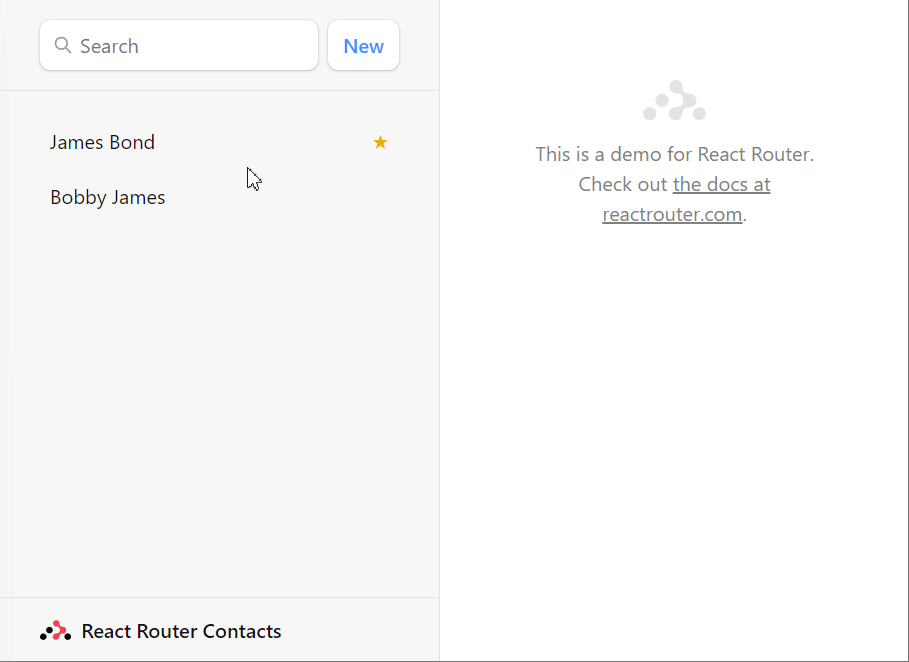

# React Router Tutorial
This repo contains the code for a basic React application with routing implemented using React Router. The tutorial covers the following topics:

- Setting up a new React app with Vite
- Installing React Router and adding routes to the app
- Using the Link component to navigate between routes
- Using the useParams hook to access dynamic route parameters
- Using the useHistory hook to programmatically navigate between routes

## Running the app
To run the app, clone this repo and run the following commands:

```
npm install
npm start dev
```

The app should open in your browser at http://localhost:3000.

## Demo
Here's a screen recording of the final result:



## License
This project is licensed under the MIT License - see the LICENSE file for details.